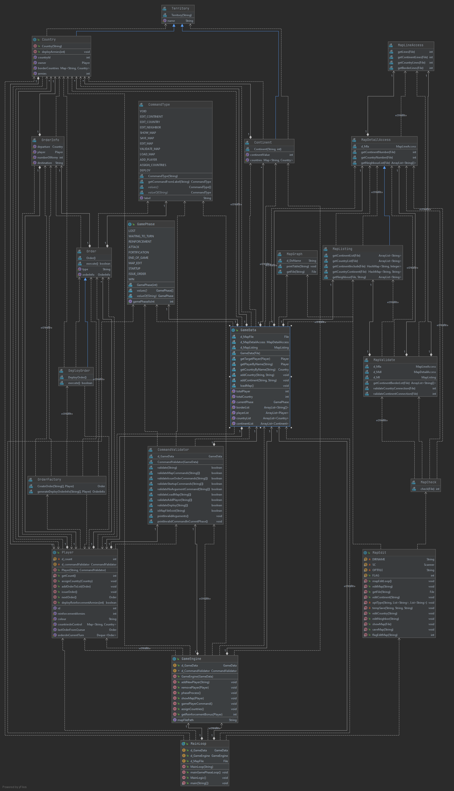

# Soen 6441 Team_05 Project WarZone
## Build 1:

**Group 5**
Group Member:
- Yongtang Lu
- Jiaming Han
- Dejian Wang
- Zitao Wang
- Haochen Zou

**======================Build 1 ================================**

User will first get into option phase

 Welcome to Warzone.
user can type the following command in the console.
command: **edit / play / exit  (ignore-case)**

Type **edit** if user  want to get into Map Editor model.
 
 **if you are in Map Editor model:**
 you will be asked to enter the following command to edit model.map. 
 command: **1. editmap filename     (example: editmap 01.model.map)**
          **2. savepmap filename    (example: savepmap 01.model.map)**
          **3. showmap              (example: showmap)**
          **4. validatemap          (example: validatemap)**
          
 1. if enter command **editmap filename**: you will be continue to asked the following command to edit the model.map you selected.
command: **1. editcontinent -add continentID continentValue (example: editcontinent -add Asia 1 -add Europe 2)**
         **2. editcountry -add countryID continentID (example: editcountry -add 1 China 1 -add 2 Korea 1)**
         **3. editneighbor -add countryID neighborcountryID (example: editneighbor -add 1 2)**
          
    **4. editcontinent -remove continentID  (example: editcontinent -remove Asia -remove Egypt)**
    **5. editcountry -remove countryID  (example: editcountry -remove 3 Russia 2 -remove 4 Finland 2)**
    **6. editneighbor -remove countryID neighborcountryID (example: editneighbor -remove 4 3 -remove 3 1)**
 
 2. if enter command **savemap filename**: your current edit model.map will be saved.
 
 3. if enter command **showmap**: the model.map you current edit will be displayed as text.
 
 4. if enter command **validatemap** the model.map you current edit will be validate if valid or not, this can be happen during editing and before saving. 
 
 
 Type **play** if user  want to get into playing game model.
 
 **if you are in playing game model:**

 
1. you will be asked to enter the following **command** to load the game
  command: **Loadmap filename   (example: Loadmap 01.model.map)**
  
 then the represent Graph of the model.map file information will showing up.

2. you will be asked to add or remove player for this game (y/n)
  command: enter **y** for yes, and **n** for no.

3. if yes, you will be asked to enter the following **command** to add/remove player to this game (player limit: 2 to 5)
  command: **gameplayer -add PlayerName   (example: gameplayer -add Alice)**

4. if no (and the player is not out of bound),  the game will be start. you will be asked to enter the following command to randomly assign countries to all players:
  command: **assigncountries**
 
5. then the reinforcement armies and countries ownership will be show up for each player. 
**Reinforcement phase complete.**

6. After that, you will get into Issue order phase, and you will be asked to enter following command to issue order for each player.
  command: **deploy countryID num   (example: deploy china 5)**
  (1. Tips:the number of deployed armies cannot over reinforcement armies)
  (1. Tips:the deployed country must have ownership of current player)
 **Issue Order Phase Complete**
 
7. After each player have already issued their orders, the game will get into execute order phase. and current model.map model.state will be show up for each player after execute orders.
 **Execute Order Phase Complete**
 
 
 Type **exit** if user  want to exit the game.
 
## Build 1 Architecture UML
 

**======================Build 2 ================================**

**Refactoring Part**

**Refactoring about State Pattern**
In gernal, we refactored the game progress in the first version according to the statepattern design mode. As the result, the following refactoring was carried out:

1. We separate the game Phase of the previous version to the following part to , and impletement the phases of the application.
  A. MapEdit `preload, postload`  the class is used to impletement all the functions about map edit state. 
  B. GamePlay `PlaySetup, MainPlay`  the class is used to impletement all the functions about game play state. 
  B_1: PlaySetup (extends Gameplay) `Phase: set Players, assign Countries` the class is used to impletement all the functions before start to playing the game.
  B_2: MainPlay (extends Gameplay) `Phase: Reinforcement, IssueOrder, Execute` the class is used to impletement all the functions during the playing time.
  
2. a. Add a new abstract class _Phase.java_, which includes the abstract methods that need to be implemented at each phase, hence it being inherited by `Edit.java` class and `Play.java` class.
   b. Add GameDriver class _GameDriver.java_, which use to demo the program. so  this is a public class in package _model_.
   
   c. Remove the old main Demo class_Mainloop.java_ in previous version, since the functions of previous version it contains have been assigned to different states to be called
   d. Remove the _GamePhase.java_ class in previous version, since the game phase in our current version is being called from _GameData.java_ class
 
3. Now our new main Demo class _Mainloop.java_ , we add a "Phase/command" menu for user, it will introduce the user what commands that need to be entered in each state, and automatically turn to next state according to user`s command.

**Refactoring about Command Pattern**
4. 

5.

**New functions in Order Creation Phase**
